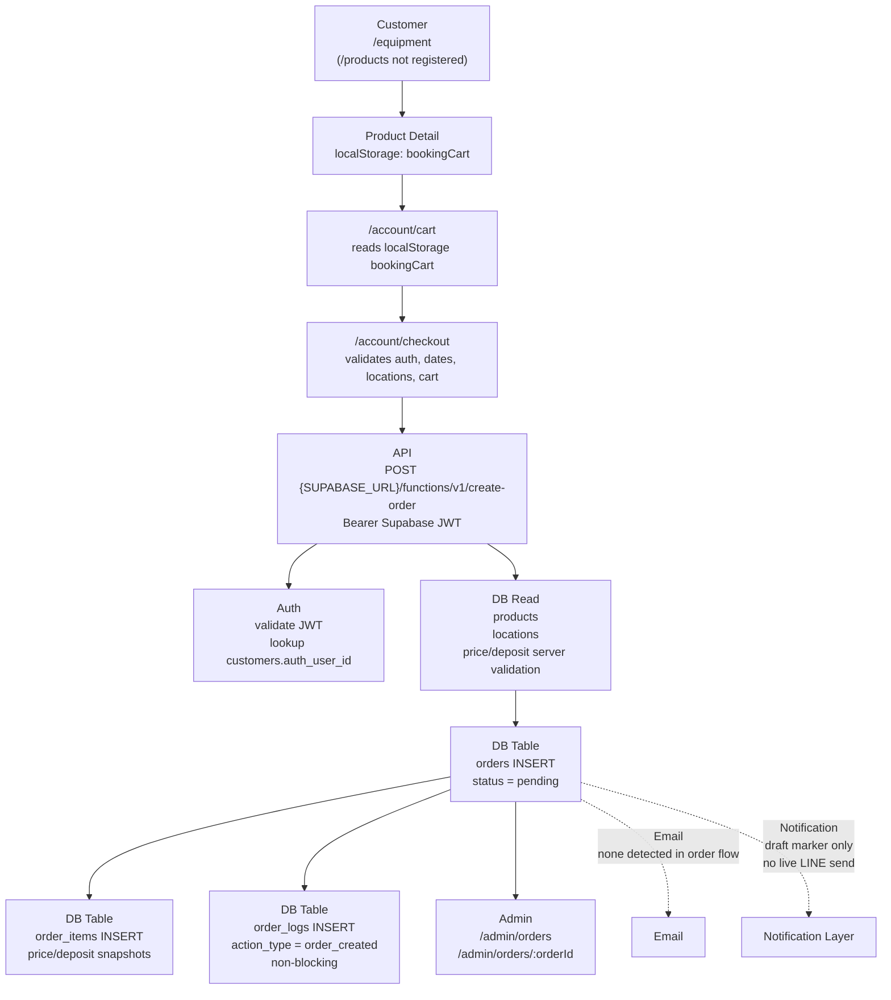
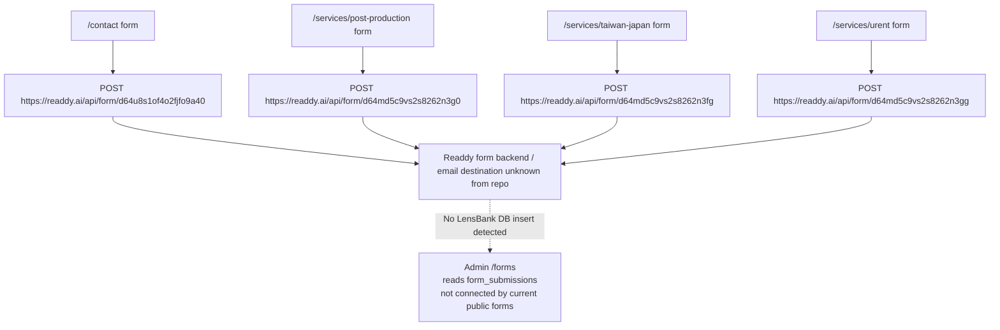
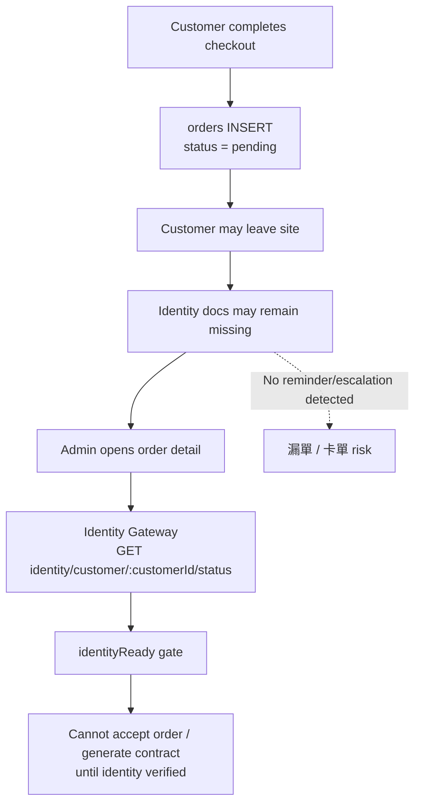
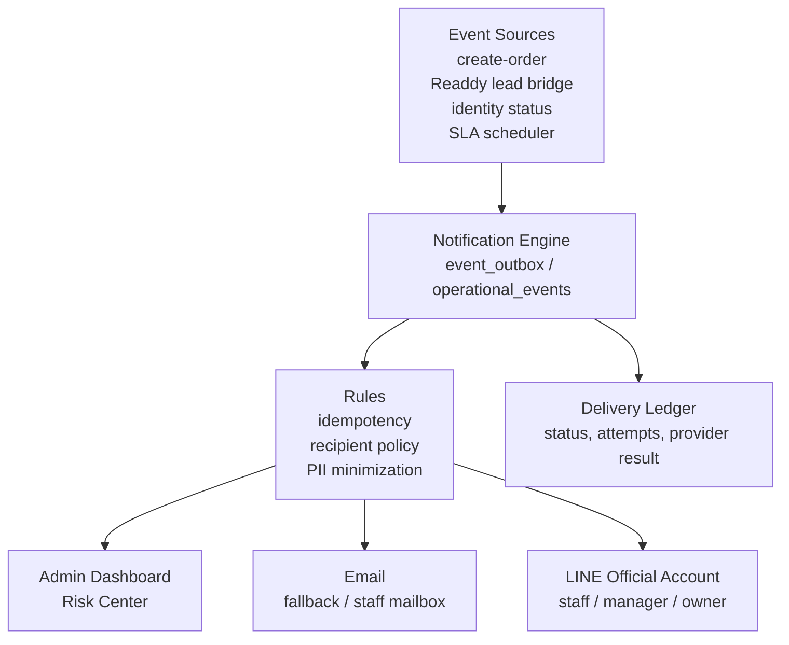

# LensBank P0 - Order & Lead Safety Hardening

Date: 2026-06-11

Scope:

- Audit
- Gap Analysis
- Notification Layer Design
- Operational Dashboard Design

Safety boundary:

- No customer flow changes.
- No Cloudflare Production changes.
- No Readdy frontend behavior changes.
- No deploys were performed.
- No production database write was performed.
- Production identity statistics were run through read-only aggregate `SELECT` only.
- No detail identity-gap query was executed in P0-F.

## Deliverables Index

| File | Purpose |
|---|---|
| `README.md` | Main P0 summary, earlier P0-A to P0-E findings, and P0-F index |
| `LEAD_INQUIRY_DELIVERY_AUDIT.md` | P0-G0 lead and inquiry delivery audit |
| `P0_G1_G2_ACCEPTANCE_REPORT.md` | Acceptance report for admin badge and customer identity guidance |
| `P0_G3_STAGING_PREVIEW_SMOKE.md` | Staging/local preview smoke result for P0-G1/G2 |
| `STAGING_FRONTEND_ENV_CHECKLIST.md` | P0-G3B frontend public env checklist and fill instructions |
| `SMOKE_TEST_DATASET_PLAN.md` | P0-G3E staging smoke dataset plan and owner apply gate |
| `OPTIONAL_STAGING_SEED.sql` | Owner-reviewed optional staging seed draft; not executed by Codex |
| `P0_G3F_STAGING_COVERAGE_CHECK.md` | Live staging aggregate coverage check; blocked without confirmed staging read-only DB |
| `IDENTITY_CONVERSION_ANALYSIS.md` | P0-G4A identity conversion funnel analysis and fix priority |
| `IDENTITY_FUNNEL_METRICS_READONLY.sql` | P0-G4A aggregate-only funnel, timing, and drop-off SQL |
| `IDENTITY_CONVERSION_UX_CONTRACT.md` | P0-G5A identity conversion UX contract and page-level behavior |
| `IDENTITY_COPY_CONTRACT.md` | P0-G5A customer-facing copy contract and trust messaging |
| `IDENTITY_UI_WIREFRAME.md` | P0-G5A checkout success, account orders, and order detail wireframe proposal |
| `IDENTITY_REMINDER_STRATEGY.md` | P0-G5A reminder, staff escalation, and conversion impact strategy |
| `IDENTITY_UPLOAD_ENTRY_AUDIT.md` | P0-G5C identity upload route/API discovery and current CTA audit |
| `IDENTITY_UPLOAD_FLOW_MAP.md` | P0-G5C current flow, shortest path, and flow gap mapping |
| `IDENTITY_UPLOAD_UX_RECOMMENDATION.md` | P0-G5C dedicated upload route recommendation and wireframe |
| `IDENTITY_UPLOAD_MVP_READINESS_AUDIT.md` | P0-G5B backend/gateway/storage/DB/admin/frontend readiness audit for identity upload MVP |
| `IDENTITY_UPLOAD_MVP_FLOW_CONTRACT.md` | P0-G5B minimal customer upload flow contract for `/account/identity` |
| `IDENTITY_UPLOAD_MVP_RISK_ASSESSMENT.md` | P0-G5B risk assessment and implementation option recommendation |
| `P0_G5B1_IDENTITY_GATEWAY_RUNTIME_VERIFICATION.md` | P0-G5B.1 staging identity gateway runtime route/auth/CORS verification |
| `IDENTITY_UPLOAD_MVP_IMPLEMENTATION_CONTRACT.md` | P0-G5B.2 isolated customer `/account/identity` implementation contract |
| `IDENTITY_CUSTOMER_FLOW_WIRING_PLAN.md` | P0-G5B.2 checkout/account/orders identity status and upload wiring plan |
| `IDENTITY_UPLOAD_MVP_ACCEPTANCE_CHECKLIST.md` | P0-G5B.2 preview acceptance checklist for customer identity upload MVP |
| `P0_G5B3_IDENTITY_UPLOAD_MVP_IMPLEMENTATION_REPORT.md` | P0-G5B.3 isolated preview implementation report and mutation guard notes |
| `P0_G5B4_IDENTITY_UPLOAD_DRY_RUN_SMOKE.md` | P0-G5B.4 local dry-run preview smoke and authenticated-session blocker notes |
| `P0_G5B5_OWNER_AUTH_DRY_RUN_GUIDE.md` | P0-G5B.5 owner authenticated dry-run smoke guide and screenshot/network checklist |
| `IDENTITY_UPLOAD_MVP_REVIEW_PACKAGE.md` | P0-G5B.6 owner/CTO preview review package for `/account/identity` MVP |
| `P0_G5B7_READDY_HANDOFF_PACKAGE.md` | P0-G5B.7 Readdy handoff package with GitHub canonical links and porting boundaries |
| `READDY_IDENTITY_UPLOAD_MVP_PROMPT.md` | Paste-ready Readdy prompt for customer identity upload MVP only |
| `IDENTITY_COMPLETION_FLOW_AUDIT.md` | P0-F1 customer identity completion flow audit |
| `ADMIN_ORDER_SAFETY_AUDIT.md` | P0-F2 admin order safety audit |
| `NOTIFICATION_EVENT_DESIGN.md` | P0-F3 notification events, idempotency, fallback, feature flags |
| `STATUS_MODEL_RECOMMENDATION.md` | P0-F4 additive status mapping recommendation |
| `MANUAL_REMEDIATION_SOP.md` | P0-F5 manual SOP for the 6 missing-identity orders |
| `IMPLEMENTATION_PHASE_PLAN.md` | P0-F6 safe implementation split P0-G1 to P0-G5 |
| `identity_90d_readonly.sql` | Aggregate read-only identity completion query |
| `identity_gap_detail_readonly.sql` | Optional masked detail query; not executed in P0-F |
| `SUPABASE_ENV_INSTRUCTIONS.md` | Local read-only Supabase connection instructions |

## Executive Summary

P0 finding: the suspected identity-dropoff path is possible in the current code.

Current flow allows a customer to create an order without uploading identity documents. Identity verification is checked later in the admin order detail before accepting the order or generating a contract. There is no detected customer reminder, staff LINE notification, live email notification, or dashboard risk queue that guarantees staff will notice the blocked order.

Read-only production aggregate result:

| Metric | Count |
|---|---:|
| Orders in last 90 days | 10 |
| Uploaded both sides | 4 |
| Missing identity upload | 6 |
| Pending review | 0 |
| Verified ready | 4 |
| Rejected | 0 |

P0-F conclusion: 60% of recent orders are missing identity upload. This is an active operational漏單 / 卡單 risk, not only a UX issue.

The largest漏單 risks are:

1. New public inquiry forms submit to Readdy form endpoints, not to LensBank DB tables visible in the admin form center.
2. New order creation writes to `orders` and `order_items`, but live notification is effectively absent or draft-only.
3. Identity document upload is not required at checkout, and no reminder/escalation loop was found.
4. The admin dashboard has a pending order count, but not an operational risk center for identity-missing, stale pending, or unanswered leads.
5. Customer-facing pages after checkout do not show a clear identity supplement CTA.
6. Admin order list does not show missing identity at a glance; staff must open order detail.

P0-G5B readiness update:

- Identity Upload MVP is not frontend-only ready.
- DB/storage foundation appears mostly ready from source migration and governance docs.
- Gateway upload endpoints are documented, but executable gateway source was not found in this workspace.
- Readdy frontend currently uses identity status and contract asset reads only; customer upload-session/upload-complete wiring is missing.
- `/account/identity?orderId=...` is recommended as the dedicated customer upload entry.
- Recommended next path is gateway endpoint verification/patch plus frontend implementation in staging only.

## Phase P0-F Summary

| Question | Answer |
|---|---|
| Can customers submit checkout without identity upload? | Yes |
| Does checkout success show identity supplement CTA? | No |
| Does `/account/orders` show identity status? | No |
| Does `/account/orders/:id` link to identity upload? | No |
| Is there `/account/documents` route? | No |
| Does admin order detail show identity state? | Yes |
| Does admin order list show identity state? | No |
| Is there `/admin/identity-verification` route? | No |
| Is a DB migration required for immediate P0-G1/G2 visibility? | No; use additive read-only derived state/API first |
| Should `orders.status` be rewritten now? | No |

Recommended MVP sequence:

0. P0-G0: lead and inquiry delivery audit.
1. P0-G1: admin visibility quick win.
2. P0-G2: checkout / account補件導引.
3. P0-G3: internal LINE notification MVP behind feature flags.
4. P0-G4: 24h/72h reminders with idempotent logs.
5. P0-G5: email fallback after delivery path audit.

## Evidence Map

Primary files reviewed:

- `readdy-frontend/src/App.tsx`
- `readdy-frontend/src/router/config.tsx`
- `readdy-frontend/src/pages/equipment/detail/page.tsx`
- `readdy-frontend/src/pages/equipment/components/ProductDetailPanel.tsx`
- `readdy-frontend/src/pages/account/cart/page.tsx`
- `readdy-frontend/src/pages/account/checkout/page.tsx`
- `readdy-frontend/src/pages/account/checkout/success/page.tsx`
- `readdy-frontend/src/pages/account/orders/page.tsx`
- `readdy-frontend/src/pages/account/orders/detail/page.tsx`
- `readdy-frontend/src/pages/account/profile/page.tsx`
- `readdy-frontend/src/services/edgeFunctionEndpoints.ts`
- `supabase/functions/create-order/index.ts`
- `readdy-frontend/src/pages/contact/page.tsx`
- `readdy-frontend/src/pages/services/post-production/page.tsx`
- `readdy-frontend/src/pages/services/taiwan-japan/page.tsx`
- `readdy-frontend/src/pages/services/urent/page.tsx`
- `readdy-frontend/src/pages/admin/forms/page.tsx`
- `readdy-frontend/src/pages/admin/dashboard/page.tsx`
- `readdy-frontend/src/pages/admin/orders/page.tsx`
- `readdy-frontend/src/pages/admin/orders/detail/page.tsx`
- `readdy-frontend/src/pages/admin/orders/contract/page.tsx`
- `readdy-frontend/src/pages/admin/customers/page.tsx`
- `readdy-frontend/src/pages/admin/customers/components/customer-table.tsx`
- `readdy-frontend/src/components/admin/IdentityGatingBanner.tsx`
- `readdy-frontend/src/modules/identity/types.ts`
- `readdy-frontend/src/modules/identity/helpers.ts`
- `readdy-frontend/src/modules/order/order-status-semantics.ts`
- `readdy-frontend/src/services/identityGatewayService.ts`
- `lensbank-identity-gateway/README.md`
- `supabase/migrations/20260526_0001_customer_identity_documents_phase1_staging_only.sql`
- `supabase/functions/admin-order-status-update/index.ts`
- `supabase/functions/customer-line-order-status-live-hook/index.ts`
- `supabase/functions/customer-line-order-status-live/index.ts`
- `supabase/functions/line-notify-send/index.ts`
- `readdy-frontend/src/services/emailService.ts`

## Phase P0-A - 全站漏單風險 Audit

### A1 訂單建立流程

Important route note:

- The current registered product browsing route is `/equipment`, not `/products`.
- `/products` was not found as a registered route in the current Readdy frontend.
- The current cart and checkout routes are `/account/cart` and `/account/checkout`.



Order creation implementation:

- Frontend checkout calls `EDGE_FUNCTION_ENDPOINTS.createOrder()`, which resolves to Supabase Edge Function `create-order`.
- The Edge Function validates the JWT and uses the authenticated user id to find `customers.auth_user_id`.
- Product prices and deposits are reloaded from DB and compared with frontend snapshots.
- The order starts as `status = pending`.
- `order_items` insert failure triggers compensating deletion of the created order.
- `order_logs` insert is best-effort and non-blocking.

DB tables touched by order creation:

| Table | Purpose | Current behavior |
|---|---|---|
| `customers` | Authenticated customer lookup | Read by `auth_user_id` from JWT |
| `products` | Product validation | Read for active products and canonical price/deposit |
| `locations` | Pickup/return validation | Read and must be active |
| `orders` | Order header | Inserted by `create-order` |
| `order_items` | Order line items | Inserted by `create-order` |
| `order_logs` | Audit log | Inserted best-effort after order creation |

Key `orders` fields inserted by `create-order`:

- `order_number`
- `customer_id`
- `user_id`
- `start_date`
- `end_date`
- `pickup_location_id`
- `return_location_id`
- `total_price`
- `total_deposit`
- `total_amount`
- `status`
- `notes`
- `vehicle_included`
- `vehicle_confirmed`
- `vehicle_fee`
- `prepaid_used`
- `prepaid_real_amount`
- `prepaid_bonus_amount`

Key `order_items` fields inserted by `create-order`:

- `order_id`
- `product_id`
- `quantity`
- `daily_price_snapshot`
- `deposit_snapshot`
- `subtotal`
- `days`

Current notification state for order creation:

| Layer | Current state |
|---|---|
| Email | No live email call detected from checkout or `create-order`. `EmailService` is console-simulation oriented and not called by this flow. |
| LINE | `create-order` records a draft marker only. Customer LINE order hook functions are guarded/draft-only and do not perform a live provider send in the reviewed flow. |
| Admin | Admin can see DB-created orders if they open/list admin order pages. This depends on human checking, not an active notification. |

### A2 官網需求單流程

Important route note:

- `/contact` exists.
- `/contact-us` was not found as a registered route.
- `/services` exists as a services landing/read page.
- Service inquiry forms exist under specific service pages.



Public inquiry forms:

| Form | Route | API | Destination in repo | DB write detected | Risk |
|---|---|---|---|---|---|
| Contact | `/contact` | `https://readdy.ai/api/form/d64u8s1of4o2fjfo9a40` | Readdy form endpoint | No LensBank DB write detected | High |
| Post-production inquiry | `/services/post-production` | `https://readdy.ai/api/form/d64md5c9vs2s8262n3g0` | Readdy form endpoint | No LensBank DB write detected | High |
| Taiwan-Japan inquiry | `/services/taiwan-japan` | `https://readdy.ai/api/form/d64md5c9vs2s8262n3fg` | Readdy form endpoint | No LensBank DB write detected | High |
| URent inquiry | `/services/urent` | `https://readdy.ai/api/form/d64md5c9vs2s8262n3gg` | Readdy form endpoint | No LensBank DB write detected | High |
| Contact-us | `/contact-us` | None found | Route not registered | None | Medium |
| Services landing | `/services` | Reads service cases | No inquiry submit detected | None | Low |

Admin form center gap:

- `admin/forms` reads `form_submissions`, `form_submission_logs`, and `form_submission_notes`.
- No public Readdy form submission path was found that inserts into `form_submissions`.
- Therefore, Readdy public leads may not appear in the LensBank admin form center unless a separate Readdy-side integration exists outside this repo.

Related authenticated application flows:

| Flow | Route | DB write detected | Note |
|---|---|---|---|
| URent member application | `/account/urent/apply` | `urent_applications` | Authenticated member flow, separate from public Readdy inquiry form |
| Prepaid member application | `/account/prepaid/apply` | `prepaid_applications` | Authenticated member flow, separate from public Readdy inquiry form |

### A3 身分證上傳流程

Current answer: A - 未上傳也能送出訂單.

Evidence:

- Checkout validation checks auth, cart, dates, locations, notes length, and role restrictions.
- `create-order` validates auth, customer, products, locations, pricing, and totals.
- No identity upload, identity status, or document verification gate was found before inserting the order.
- Admin order detail checks identity status later. If identity is not ready, admin accept/contract generation is gated.



Identity DB structure found in staging migration:

Table: `customer_identity_documents`

| Column | Purpose |
|---|---|
| `id` | Document record id |
| `customer_id` | Customer owner |
| `document_type` | Defaults to `taiwan_id` |
| `front_image_path` | Private storage path for ID front |
| `back_image_path` | Private storage path for ID back |
| `front_sha256` | Front checksum |
| `back_sha256` | Back checksum |
| `verification_status` | `pending`, `verified`, `rejected`, `expired`, `purged` |
| `rejected_reason` | Rejection reason |
| `verified_at` | Verification timestamp |
| `verified_by` | Verifying admin |
| `retained_until` | Retention limit |
| `purged_at` | Purge timestamp |
| `purge_reason` | Purge reason |
| `created_by_customer_id` | Customer uploader |
| `created_by_admin_id` | Admin creator |
| `created_at` | Created timestamp |
| `updated_at` | Updated timestamp |

Identity API surface found:

| API | Current role in frontend/repo |
|---|---|
| `GET /identity/me/status` | Customer status endpoint declared in frontend service |
| `GET /identity/customer/:customerId/status` | Admin status endpoint used by admin order detail |
| `POST /contract/:orderId/identity-assets` | Contract identity asset handoff endpoint declared |
| `POST /identity/upload-session` | Documented in identity gateway README |
| `POST /identity/upload-complete` | Documented in identity gateway README |
| `POST /identity/precheck` | Documented in identity gateway README |
| `POST /identity/verify` | Documented in identity gateway README |
| `POST /identity/reject` | Documented in identity gateway README |
| `GET /identity/:id/view-url` | Documented in identity gateway README |
| `POST /identity/:id/redact` | Documented in identity gateway README |

Storage bucket:

| Bucket | Public | Purpose |
|---|---:|---|
| `customer-identity-documents` | false | Private ID document storage |

Validation rules found in migration:

- `document_type` constrained to known values such as `taiwan_id`.
- `verification_status` constrained to `pending`, `verified`, `rejected`, `expired`, `purged`.
- Front/back image paths must be paired: both present or both absent.
- Image paths are constrained to customer-scoped path formats.
- Direct customer table access is denied; status should be mediated by Edge/API.
- Helper function `has_verified_customer_identity_document(customer_id)` checks verified, not purged, and retained.

Production caveat:

- The identity migration filename and comments identify it as Phase 1 staging/source foundation.
- Production application of this schema was not confirmed by static audit.

## Phase P0-B - Notification Gap Report

| Event | Current State | Email | LINE | Admin Dashboard | Future State | Risk Level |
|---|---|---|---|---|---|---|
| 訂單建立 | `orders` and `order_items` are created; `order_logs` best-effort; draft notification marker only | None detected | None live detected | Order appears if staff checks admin | Emit `order.created` event to notification outbox; dashboard + email fallback + LINE OA internal alert | Critical |
| 訂單待確認 | `orders.status = pending`; admin list/dashboard can count pending | None detected | None detected | Pending count exists, but no SLA aging/escalation queue | SLA events at 24h and 72h; manager/owner escalation | High |
| 客戶補件 / 身分證未補件 | Checkout does not require identity; admin detail blocks accept/contract only when opened | None detected | None detected | Identity gating is visible in order detail only | `identity.missing.24h` reminder and ops escalation; dashboard risk card | Critical |
| 新需求單 | Public forms submit to Readdy endpoints; no LensBank DB insert found | Unknown outside repo | None detected | `admin/forms` reads DB table not connected to public forms in repo | Mirror/ingest leads into DB; notify ops immediately | Critical |

## Phase P0-C - 營運安全通知架構

Design principle:

- Additive only.
- Start as dashboard-only or dry-run.
- Do not block checkout.
- Do not change public Readdy form behavior in phase 1.
- Do not call external providers until allowlisted and explicitly enabled.



Recommended additive tables or views:

| Object | Purpose |
|---|---|
| `operational_events` or `notification_outbox` | Durable source of events and reminders |
| `notification_delivery_ledger` | Idempotent delivery attempts and provider responses |
| `notification_rules` | Channel enablement, severity, recipients, cooldowns |
| `v_owner_ops_risk_center` | Read-only dashboard source for owner safety panel |

PII safety:

- Notification message should include order number, risk type, age, and admin deep link.
- Do not include ID image URLs, ID numbers, raw document paths, or customer private document data in LINE/email.
- Identity document access should remain mediated by identity gateway and signed URLs.

### Event 1 - 新訂單

| Field | Design |
|---|---|
| Event | `order.created` |
| Trigger | Successful `orders` and `order_items` creation |
| Idempotency key | `order.created:{order_id}` |
| Channels | Admin dashboard, Email fallback, LINE OA staff alert |
| Initial phase | Dashboard + dry-run ledger |
| Message | `新訂單 {order_number} 已建立，狀態 pending` |

### Event 2 - 新需求單

| Field | Design |
|---|---|
| Event | `lead.created` |
| Trigger | Readdy form mirror/bridge or future first-party DB form insert |
| Idempotency key | `lead.created:{source}:{source_submission_id}` |
| Channels | Admin dashboard, Email fallback, LINE OA staff alert |
| Initial phase | DB mirror + dashboard only |
| Message | `新需求單 {form_type}，請於 SLA 內回覆` |

### Event 3 - 身分證未補件 24 小時

| Field | Design |
|---|---|
| Event | `identity.missing.24h` |
| Trigger | Order created more than 24h ago and latest customer identity is missing or not verified |
| Idempotency key | `identity.missing.24h:{order_id}` |
| Channels | Admin dashboard, Email fallback, LINE OA staff alert |
| Initial phase | Dashboard + internal staff notification |
| Message | `訂單 {order_number} 建立超過 24 小時，身分證尚未完成` |

### Event 4 - 待確認超過 24 小時

| Field | Design |
|---|---|
| Event | `order.pending.24h` |
| Trigger | `orders.status = pending` and age >= 24h |
| Idempotency key | `order.pending.24h:{order_id}` |
| Channels | Admin dashboard, LINE OA 店長, Email fallback |
| Initial phase | Dashboard + manager allowlist |
| Message | `訂單 {order_number} 待確認超過 24 小時` |

### Event 5 - 超過 72 小時通知 Owner

| Field | Design |
|---|---|
| Event | `order.stale.72h` |
| Trigger | Pending/need-info/identity-missing operational state age >= 72h |
| Idempotency key | `order.stale.72h:{order_id}` |
| Channels | Admin dashboard, LINE OA Owner, Email fallback |
| Initial phase | Owner allowlist only |
| Message | `高風險訂單 {order_number} 已超過 72 小時未解除` |

## Phase P0-D - Owner Dashboard Safety Panel

Design only. No implementation in P0-A.

Homepage card group: `營運風險中心`

| Card | Definition | Target action |
|---|---|---|
| 待確認訂單 | `orders.status = pending` | Open pending order queue |
| 待補件 | Pending/active orders where customer identity is missing, pending, rejected, or not verified-ready | Contact customer or request upload |
| 未回覆需求單 | Lead rows with `status in ('new', 'unassigned')` | Assign/reply |
| 超過24小時 | Pending/need-info/identity-missing items older than 24h | 店長 follow-up |
| 超過72小時 | Pending/need-info/identity-missing items older than 72h | Owner escalation |

Example visual spec:

```text
營運風險中心

待確認訂單        3
待補件            2
未回覆需求單      1
超過24小時        2
超過72小時        1
```

Risk queue below cards:

| Column | Purpose |
|---|---|
| Severity | Critical / High / Medium |
| Type | Order pending, identity missing, unanswered lead |
| Ref | Order number or lead id |
| Customer / Contact | Display-safe customer name/contact summary |
| Age | Time since created or last action |
| Owner | Assigned staff |
| Next action | Confirm, contact, request upload, assign lead |

Current dashboard gap:

- Admin dashboard currently counts pending orders.
- The current `newRequests` card appears to count `orders.status = need_info`, not public form submissions.
- No identity-missing count, stale pending count, lead SLA count, or owner escalation queue was found.

## Phase P0-E - Production Safe Recommendation

Recommended priority order:

| Priority | Recommendation | Value | Risk | Rating |
|---:|---|---|---|---|
| 1 | Read-only owner risk dashboard design + SQL/view spec | Immediate visibility without touching customer flow | Very low | ★★★★★ |
| 2 | Read-only 90-day identity completion audit | Quantifies biggest suspected漏單 source | Very low | ★★★★★ |
| 3 | Additive notification outbox in dry-run/dashboard-only mode | Creates durable event tracking before provider sends | Low | ★★★★★ |
| 4 | New order internal LINE OA notification | Fast staff awareness for new orders | Low-medium, gated by allowlist | ★★★★★ |
| 5 | Identity missing 24h reminder/escalation | Directly addresses suspected order卡住 path | Low-medium | ★★★★★ |
| 6 | Readdy lead DB mirror/bridge | Prevents public inquiry漏單 | Medium because external form integration must be verified | ★★★★★ |
| 7 | Email fallback for order/lead events | Backup when LINE fails | Low | ★★★★☆ |
| 8 | Pending >24h and >72h escalation | Prevents stale queue from becoming invisible | Low | ★★★★★ |
| 9 | Requiring ID before checkout | Could reduce卡單, but changes customer flow and may hurt conversion | Not allowed in current mission | Defer |

First immediate action:

1. Run the read-only 90-day identity completion query.
2. Add a read-only operational risk dashboard source spec.
3. Build notification outbox in disabled/dry-run mode before enabling LINE or email providers.

## CTO Concern - 身分驗證完成率

Current static-audit conclusion:

- The code supports the suspected failure path:
  - 客戶下單成功
  - 離開網站
  - 忘記上傳身份證
  - 員工如果沒有主動打開訂單 detail，可能不會注意
  - 訂單卡在 pending / cannot accept / cannot generate contract

Actual 90-day counts:

- Not computed yet in this audit document because production Supabase read access was not used.
- The query is prepared in `identity_90d_readonly.sql`.
- If the production `customer_identity_documents` table exists, the query can count:
  - 近90天訂單總數
  - 已上傳正反面
  - 未上傳
  - 待審核
  - 已驗證可用
  - 已拒絕

Tracking caveat:

- Identity document records appear to be customer-level, not order-level.
- Therefore, a verified customer identity may satisfy multiple orders.
- For operations, the dashboard should evaluate each order against the latest active identity document for that order's customer.

If the identity table is not present in production:

- Current tracking capability is insufficient.
- First safe step is to confirm/apply the schema in a staging-like path and add read-only dashboard visibility before enforcing any customer-flow changes.
